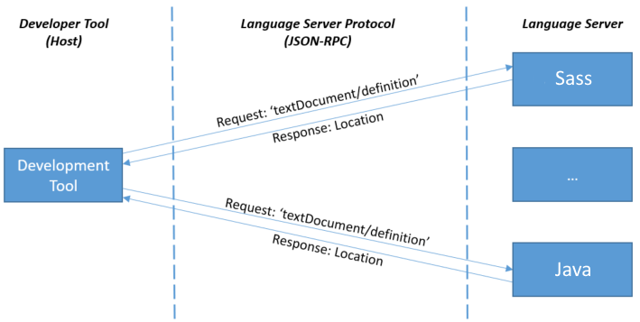
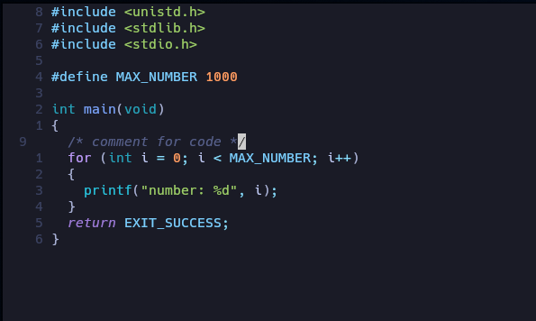
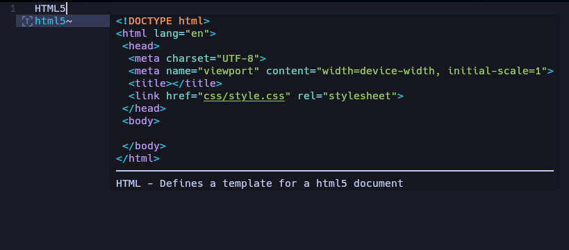
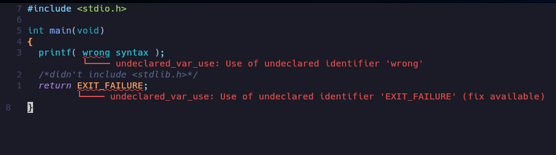
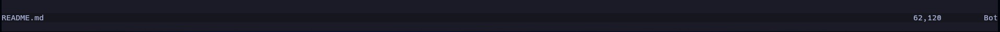
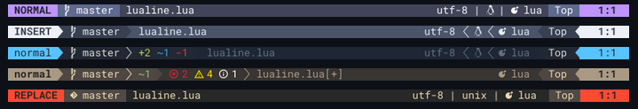

# Neovim flake dotsfile

This is my config neovim contain by nix. its a portable config using flake for
manage package you can use it in develop enironment or anything.

---

## LSP

Stand for __Language Server Protocol__ its a protocol to sync between text editor
and language server, for create feature like __Auto complete__, __Diacnostics__
, __Go to Defination__ that can understand how language be, and 
each programing language have own language-server.

---

## Treesitter

Treesitter its a __highlight feature__ for easy to see while you have coding, The highlight
come from each language server, that will highlight __"\[ \] \( \) \{ \}"__, __variable__ and
a lot of thing for you.

example:

---

## Completion and snippet

This is a feature of __auto complete__ that popup for you when you coding.  

 * Auto complete can grab data from LSP and buffer suggestion for you but its can suggest you only a word.  
 * Snippet its a tool for expand your word to multiple line of code like __HTML:5__ command in html server.

---

## Yank and Coppy

In vim We use __yank__ (shortcut \[y\]) to copy, But its have some problem We cannot __coppy__ anything to outside vim
because yank in vim its not a system coppy (shortcut \[\<C-c\>\]), in vim if you want to coppy you must virtual word
and press __double quote__ + __plus__ + __y__ (shortcut \["+y\]) to coppy it

---

## Diagnostics

This is a feature for tell you have something wrong in your code before complier tell you.
feature will call LSP and recheck you have any problem about syntax in your code, and you can see
__red underline__ and __massage__ that tell about problem.

---

## Lualine

In vim Lualine tis a status line on bottom screen show about file name and cursor by default,
But you can config to see anything you want

default lualine:

you can config this:

